# MusclePal - システムアーキテクチャ設計書

## 📋 文書情報

| 項目 | 詳細 |
|------|------|
| 文書名 | MusclePal システムアーキテクチャ設計書 |
| バージョン | 1.0 |
| 作成日 | 2025-01-07 |
| 更新日 | 2025-01-07 |

---

## 🏗️ システム全体アーキテクチャ

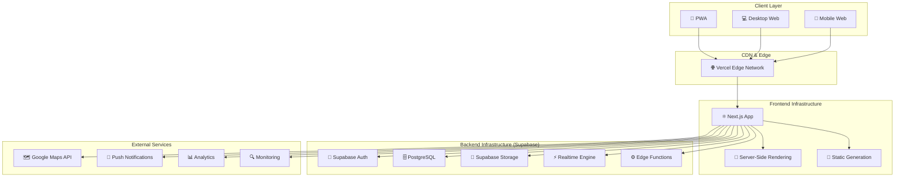

---

## 🔧 技術スタック詳細

### フロントエンド

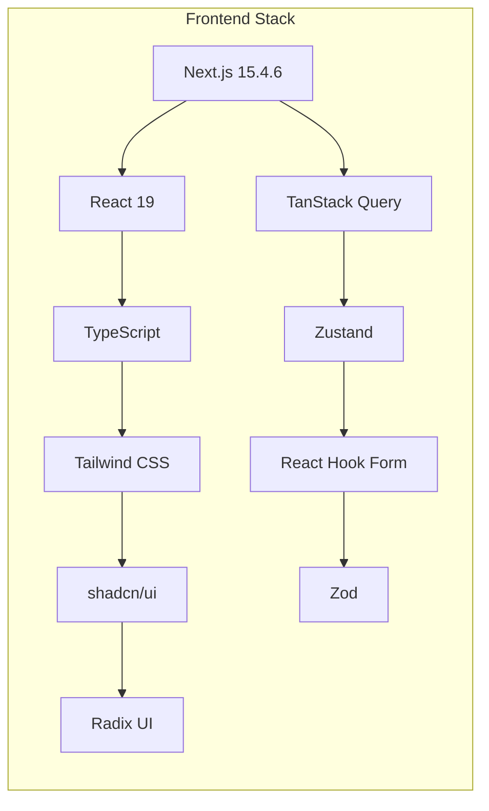

#### 主要パッケージ

| パッケージ | バージョン | 用途 |
|------------|------------|------|
| Next.js | 15.4.6 | フレームワーク |
| React | 19 | UIライブラリ |
| TypeScript | 5.2.2 | 型安全性 |
| Tailwind CSS | 4.0 | スタイリング |
| shadcn/ui | latest | UIコンポーネント |
| TanStack Query | 5.0 | サーバー状態管理 |
| Zustand | 4.4 | クライアント状態管理 |
| React Hook Form | 7.48 | フォーム管理 |
| Zod | 3.22 | スキーマ検証 |

### バックエンド (Supabase)

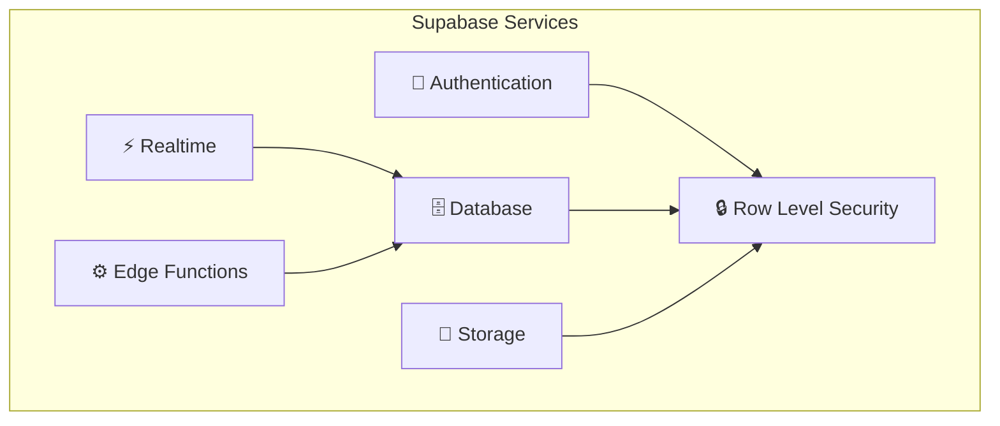

#### サービス詳細

| サービス | 機能 | 用途 |
|----------|------|------|
| Supabase Auth | JWT認証、ソーシャルログイン | ユーザー認証・認可 |
| PostgreSQL | リレーショナルデータベース | データ永続化 |
| Supabase Storage | オブジェクトストレージ | 画像・ファイル保存 |
| Realtime | WebSocket接続 | リアルタイム通信 |
| Edge Functions | サーバーレス関数 | カスタムロジック |
| RLS | 行レベルセキュリティ | データアクセス制御 |

---

## 🗃️ データベース設計

### エンティティ関係図

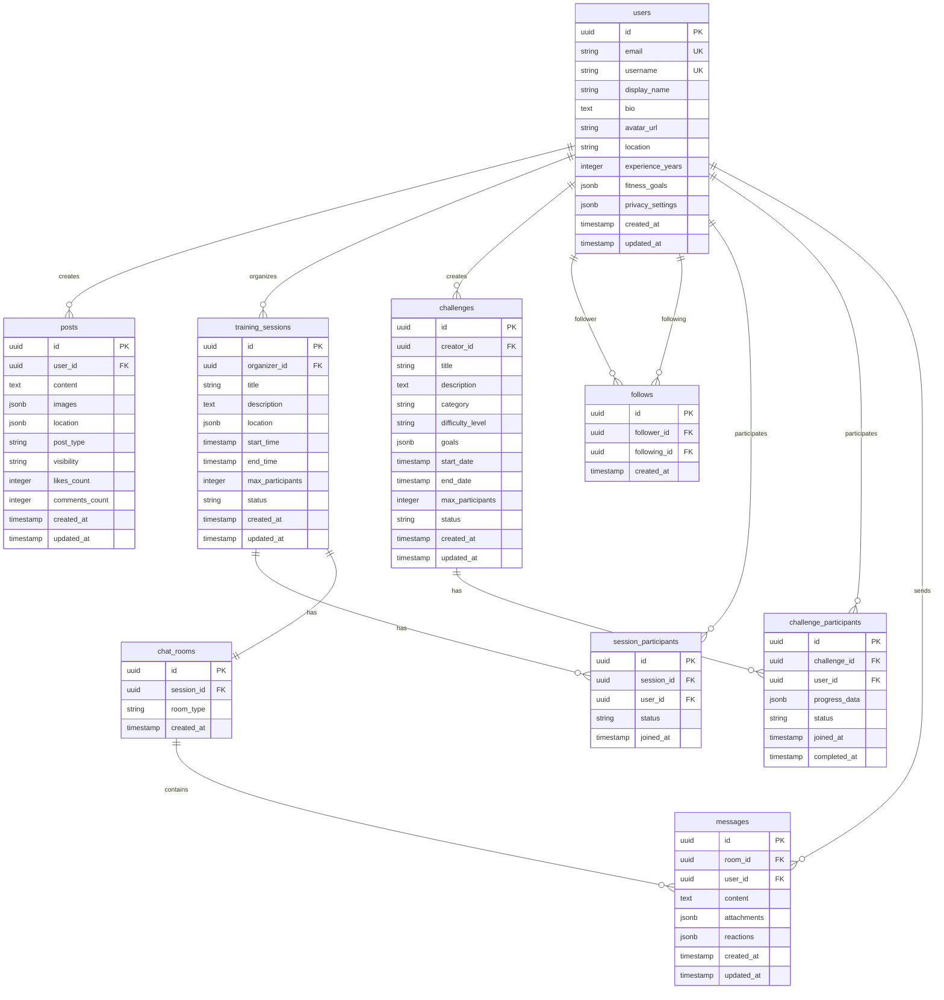

---

## 🔄 アプリケーションフロー

### ユーザー認証フロー

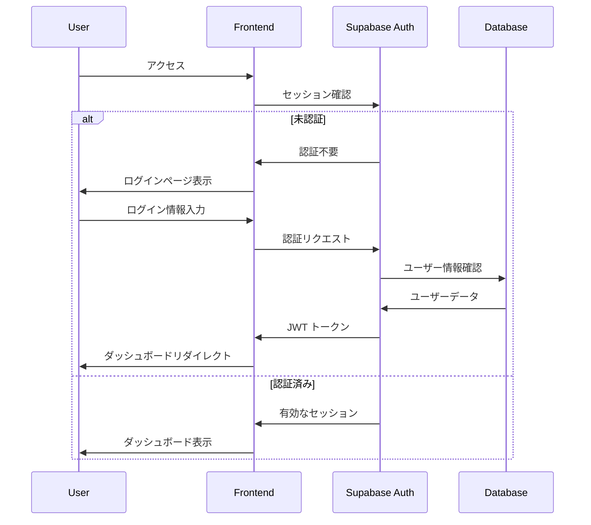

### 投稿作成フロー

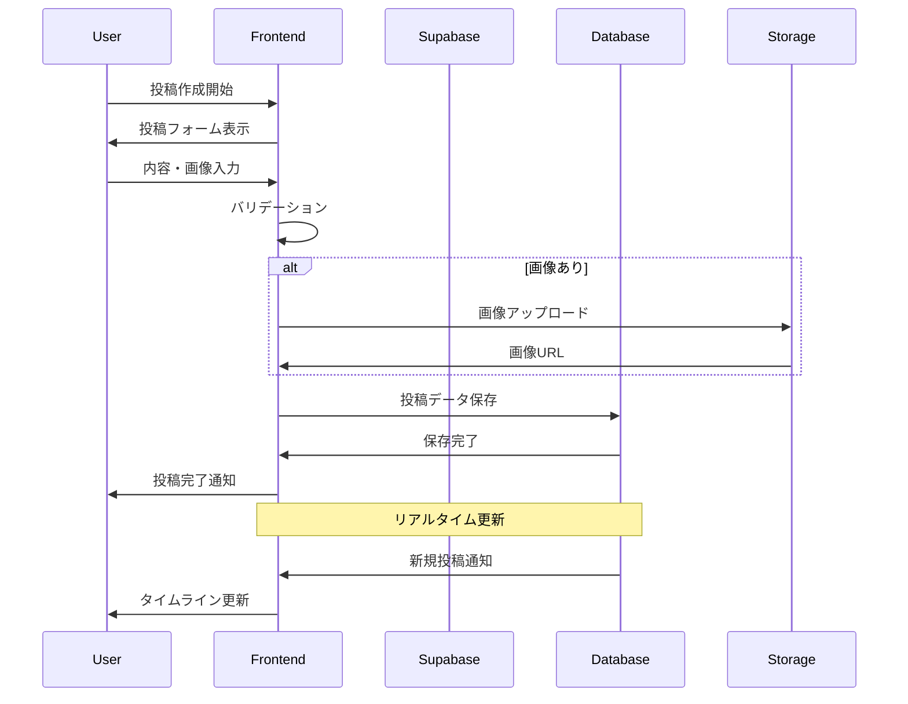

### リアルタイムチャットフロー

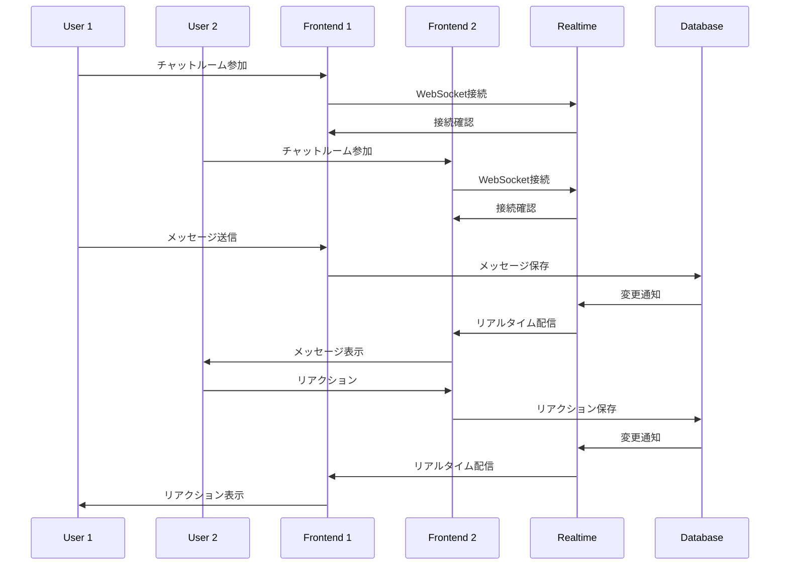

---

## 🔒 セキュリティアーキテクチャ

### 認証・認可フロー

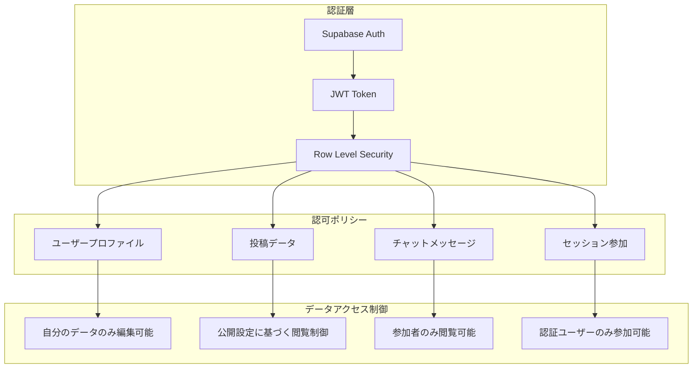

### RLSポリシー例

```sql
-- 投稿の閲覧制御
CREATE POLICY "Posts visibility policy" ON posts
FOR SELECT USING (
  visibility = 'public' OR
  (visibility = 'followers' AND EXISTS (
    SELECT 1 FROM follows 
    WHERE follower_id = auth.uid() AND following_id = posts.user_id
  )) OR
  (visibility = 'private' AND user_id = auth.uid())
);

-- プロフィールの編集制御
CREATE POLICY "Users can update own profile" ON users
FOR UPDATE USING (auth.uid() = id);

-- チャットメッセージの閲覧制御
CREATE POLICY "Chat room participants can view messages" ON messages
FOR SELECT USING (
  EXISTS (
    SELECT 1 FROM session_participants sp
    JOIN chat_rooms cr ON cr.session_id = sp.session_id
    WHERE cr.id = messages.room_id AND sp.user_id = auth.uid()
  )
);
```

---

## 📊 パフォーマンス設計

### フロントエンド最適化

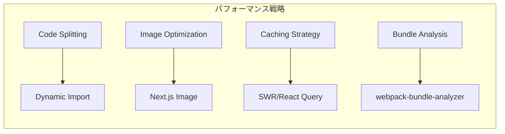

#### 最適化手法

| 項目 | 手法 | 効果 |
|------|------|------|
| 初期ロード | Code Splitting | バンドルサイズ削減 |
| 画像表示 | Next.js Image | 自動最適化・遅延ロード |
| データフェッチ | TanStack Query | キャッシュ・背景更新 |
| ルーティング | App Router | 高速ナビゲーション |

### バックエンド最適化

```sql
-- インデックス戦略
CREATE INDEX CONCURRENTLY idx_posts_user_id_created_at 
ON posts(user_id, created_at DESC);

CREATE INDEX CONCURRENTLY idx_follows_follower_following 
ON follows(follower_id, following_id);

CREATE INDEX CONCURRENTLY idx_sessions_location_time 
ON training_sessions USING GiST(location, start_time);

-- パーティション戦略（大規模時）
CREATE TABLE posts_y2025m01 PARTITION OF posts 
FOR VALUES FROM ('2025-01-01') TO ('2025-02-01');
```

---

## 🔄 CI/CD パイプライン

### デプロイメントフロー

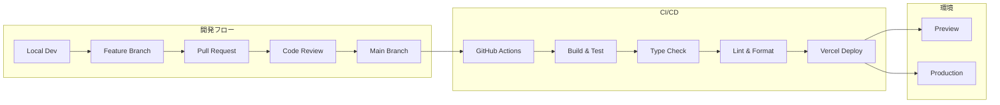

### GitHub Actions設定

```yaml
name: CI/CD Pipeline

on:
  push:
    branches: [main]
  pull_request:
    branches: [main]

jobs:
  test:
    runs-on: ubuntu-latest
    steps:
      - uses: actions/checkout@v4
      - uses: actions/setup-node@v4
        with:
          node-version: '18'
          cache: 'npm'
      
      - run: npm ci
      - run: npm run type-check
      - run: npm run lint
      - run: npm run test
      - run: npm run build
```

---

## 📊 監視・ログ設計

### 監視ダッシュボード

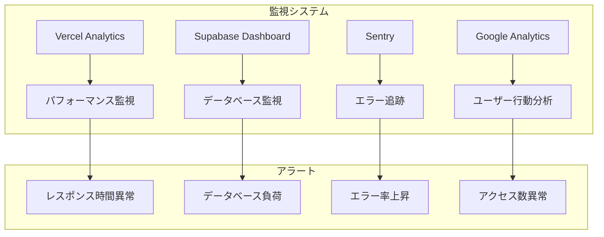

### ログ設計

```typescript
// 構造化ログ設計
interface LogEntry {
  timestamp: string;
  level: 'info' | 'warn' | 'error';
  event: string;
  userId?: string;
  sessionId?: string;
  metadata?: Record<string, any>;
}

// 使用例
logger.info('user_login', {
  userId: '123',
  method: 'email',
  timestamp: new Date().toISOString()
});
```

---

## 🚀 スケーリング戦略

### 成長段階別アーキテクチャ

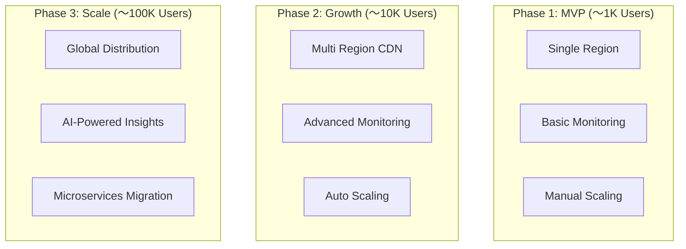

### スケーリング指標

| フェーズ | ユーザー数 | 対応策 |
|----------|------------|---------|
| Phase 1 | 〜1,000 | 基本構成で十分 |
| Phase 2 | 〜10,000 | CDN強化、監視拡充 |
| Phase 3 | 〜100,000 | マイクロサービス化検討 |
| Phase 4 | 100,000+ | 専用インフラ構築 |

---

## 📋 技術的負債管理

### 定期レビュー項目

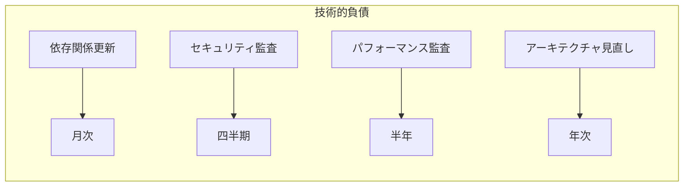

### 保守性指標

| 項目 | 目標値 | 測定方法 |
|------|--------|----------|
| テストカバレッジ | 80%以上 | Jest Coverage |
| 型安全性 | 100% | TypeScript strict |
| コード品質 | A評価 | ESLint + SonarQube |
| バンドルサイズ | 1MB未満 | webpack-bundle-analyzer |

---

*このアーキテクチャ設計書はプロジェクトの成長に合わせて継続的に更新されます。*