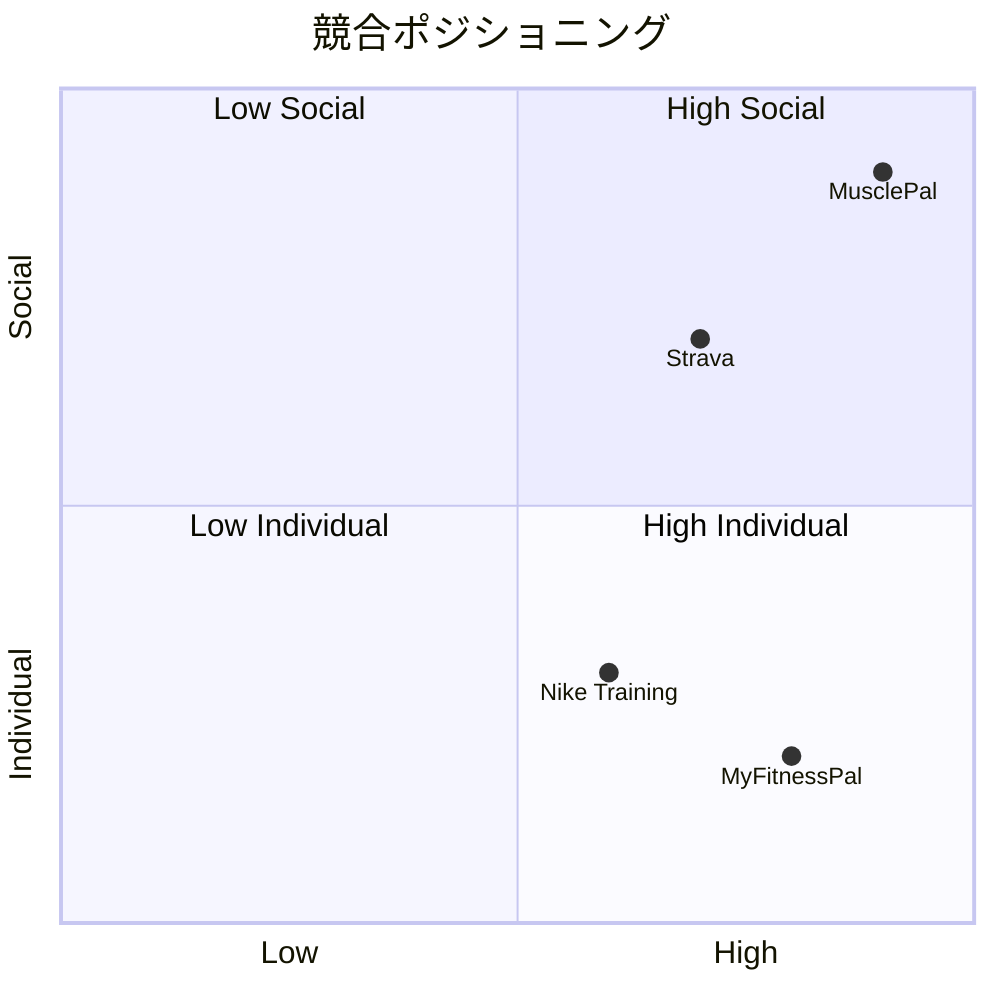

# MusclePal - プロジェクト要件定義書

## 📋 文書情報

| 項目 | 詳細 |
|------|------|
| 文書名 | MusclePal プロジェクト要件定義書 |
| バージョン | 1.0 |
| 作成日 | 2025-01-07 |
| 更新日 | 2025-01-07 |

---

## 🎯 プロダクト概要

### プロダクト名
**MusclePal（マッスルパル）**  
*サブタイトル: "フィットネスでつながる世界"*

### ミッション
フィットネス愛好者が互いにつながり、支え合い、共に成長できる包括的なソーシャルプラットフォームを提供する。

### ビジョン
- **つながり**: トレーニング仲間との出会いと絆の形成
- **成長**: 個人とコミュニティの継続的な成長
- **楽しさ**: フィットネスを通じた喜びと達成感の共有
- **健康**: 持続可能な健康的ライフスタイルの支援

### 価値提案
1. **モチベーション維持**: コミュニティの力で継続をサポート
2. **知識共有**: 経験豊富なユーザーからの学び
3. **パートナー発見**: 相性の良いトレーニングパートナーとの出会い
4. **進捗可視化**: 成長の軌跡を記録・共有・祝福

---

## 📊 市場分析

### ターゲット市場
- **国内フィットネス市場**: 約4,500億円（年成長率3-5%）
- **フィットネスアプリ市場**: 年平均成長率14%
- **ソーシャルフィットネス**: 新興高成長セグメント

### 競合分析



---

## 👥 ターゲットユーザー

### プライマリーユーザー

#### 🔰 フィットネス初心者（30%）
- **年齢**: 20-35歳
- **課題**: モチベーション維持、正しい知識習得、継続の困難
- **ニーズ**: 指導、励まし、初心者向けコンテンツ
- **ペルソナ**: 田中さん（28歳、会社員）
  - 運動不足解消のためジム入会
  - 何をすればいいかわからず継続できない
  - 一人でのトレーニングが寂しい

#### 💪 フィットネス中級者（50%）
- **年齢**: 25-45歳
- **課題**: プラトー打破、新しい刺激、トレーニングパートナー不足
- **ニーズ**: 多様なトレーニング情報、仲間との交流、目標設定
- **ペルソナ**: 佐藤さん（32歳、エンジニア）
  - トレーニング歴2年
  - 成長が停滞気味
  - 新しい刺激とモチベーションを求めている

#### 🏆 フィットネス上級者（20%）
- **年齢**: 30-50歳
- **課題**: 知識共有の場不足、高度なトラッキング需要
- **ニーズ**: 専門的議論、指導機会、詳細な分析ツール
- **ペルソナ**: 山田さん（38歳、パーソナルトレーナー）
  - トレーニング歴10年
  - 専門知識を活かして他者をサポートしたい
  - 同レベルの仲間との交流を求めている

### セカンダリーユーザー
- **パーソナルトレーナー**: クライアント管理、知名度向上
- **ジム経営者**: 集客、会員エンゲージメント向上
- **フィットネスインフルエンサー**: フォロワー拡大、収益化

---

## ⚙️ 機能要件

### 優先度レベル定義
- **🔴 P0 (Must Have)**: MVP必須機能
- **🟡 P1 (Should Have)**: リリース後早期実装
- **🟢 P2 (Could Have)**: 将来的な拡張機能

### 主要機能一覧

#### 🔐 1. ユーザー認証・プロフィール管理 (P0)

##### 認証機能
- ✅ アカウント作成（メール認証必須）
- ✅ ログイン/ログアウト
- ✅ パスワードリセット
- 🟡 ソーシャルログイン（Google、Apple）
- 🟢 二要素認証

##### プロフィール機能
- ✅ 基本情報（名前、アバター、自己紹介、所在地）
- ✅ フィットネス情報（経験年数、好きな種目、目標）
- ✅ 統計表示（投稿数、参加セッション数、チャレンジ完了数）
- ✅ プライバシー設定（公開/フォロワー限定/非公開）

#### 📱 2. ソーシャルネットワーク (P0)

##### 投稿作成
- ✅ テキスト投稿
- ✅ 画像添付（最大4枚、5MB以下）
- ✅ 位置情報（GPS自動取得、ジム名入力）
- ✅ 投稿タイプ分類（ワークアウト/プログレス/一般）
- ✅ 公開設定（パブリック/フォロワー/プライベート）

##### ソーシャル機能
- ✅ いいね・コメント
- ✅ フォロー/フォロワー機能
- ✅ タイムライン（パーソナライズ）
- ✅ 投稿削除機能

#### 🤝 3. トレーニングセッション (P1)

##### セッション管理
- ✅ セッション作成（タイトル、説明、場所、日時、定員）
- ✅ 参加申込システム
- ✅ 参加者一覧・プロフィール確認
- ✅ キャンセル・変更通知

##### セッション機能
- ✅ セッション検索（地域、日時、種目フィルタ）
- ✅ 専用チャットルーム
- 🟡 評価システム（セッション終了後フィードバック）

#### 🏆 4. チャレンジ機能 (P1)

##### チャレンジ管理
- ✅ チャレンジ作成（9カテゴリー、4難易度レベル）
- ✅ 期間設定・参加者制限
- ✅ 明確な達成条件設定

##### プログレス管理
- ✅ 詳細レポート（テキスト+数値+画像）
- ✅ 感情トラッキング（気分・エネルギー・難易度 1-5段階）
- ✅ タグ機能
- ✅ コミュニティ機能（いいね・コメント）

##### アチーブメント
- 🟡 バッジシステム
- 🟡 統計表示・ランキング
- ✅ 通知機能

#### 💬 5. リアルタイムチャット (P1)

##### 基本機能
- ✅ テキスト・画像・位置情報送信
- ✅ リアクション（8種類絵文字）
- ✅ メッセージ編集・削除
- ✅ 既読管理

##### セッション連携
- ✅ 自動チャットルーム作成
- ✅ 参加者同期
- ✅ 履歴保持

#### 🔍 6. 検索・発見機能 (P1)

##### 検索機能
- ✅ 統合検索（投稿・セッション・チャレンジ横断）
- ✅ キーワード検索
- ✅ フィルター機能（日付・カテゴリー・地域・ステータス）

##### レコメンデーション
- 🟡 おすすめユーザー
- 🟡 関連コンテンツ（AI推薦）
- 🟡 トレンド表示

---

## 🏗️ システム要件

### 技術スタック

#### フロントエンド
```typescript
Next.js 15.4.6 (App Router)    // モダンなReactフレームワーク
TypeScript 5.2.2               // 型安全性の確保
Tailwind CSS 4                 // 効率的なスタイリング
shadcn/ui + Radix UI           // 高品質UIコンポーネント
React Query / TanStack Query   // サーバー状態管理
```

#### バックエンド
```sql
-- Supabase（Backend as a Service）
PostgreSQL          -- メインデータベース
Supabase Auth       -- 認証・認可システム
Supabase Storage    -- ファイル保存
Supabase Realtime   -- リアルタイム同期
Row Level Security  -- データベース層セキュリティ
```

#### インフラ・DevOps
- **Vercel**: フロントエンドホスティング・CI/CD
- **Supabase Cloud**: バックエンドインフラ
- **Docker**: 開発環境標準化
- **GitHub Actions**: 自動テスト・デプロイ

### 非機能要件

#### パフォーマンス
- **ページロード時間**: 3秒以内（初回）、1秒以内（再訪問）
- **画像最適化**: WebP形式、遅延ロード対応
- **API応答時間**: 平均500ms以内

#### スケーラビリティ
- **同時接続ユーザー**: 10,000人対応
- **データベース**: 水平スケーリング対応
- **CDN**: グローバル配信対応

#### セキュリティ
- **認証**: JWT ベース認証
- **認可**: Row Level Security（RLS）
- **データ暗号化**: 保存時・転送時両対応
- **ファイルアップロード**: サイズ・形式制限、ウイルススキャン
- **API**: レート制限、CORS設定

#### 可用性
- **アップタイム**: 99.9%以上
- **バックアップ**: 日次自動バックアップ
- **障害復旧**: RPO 1時間、RTO 4時間以内

---

## 📱 UI/UX要件

### デザイン原則
1. **シンプル**: 直感的で学習コストの低いUI
2. **一貫性**: 全画面で統一されたデザインルール
3. **アクセシビリティ**: WCAG 2.1 AA準拠
4. **レスポンシブ**: モバイルファースト設計

### ブランドガイドライン
- **メインカラー**: Fitness Blue (#2563eb)
- **アクセントカラー**: Energy Orange (#f59e0b)
- **フォント**: Inter（可読性重視）
- **アイコン**: Lucide React（一貫性）

### 画面構成
- **モバイル**: 画面幅 375px-768px
- **タブレット**: 画面幅 768px-1024px
- **デスクトップ**: 画面幅 1024px以上

---

## 📈 成功指標（KPI）

### ユーザー指標
- **月間アクティブユーザー（MAU）**: 10,000人（6ヶ月後）
- **デイリーアクティブユーザー（DAU）**: 2,000人（6ヶ月後）
- **ユーザー継続率**: 1週間後60%、1ヶ月後30%

### エンゲージメント指標
- **セッション参加率**: 登録ユーザーの20%
- **チャレンジ完了率**: 参加者の40%
- **投稿頻度**: アクティブユーザー1人あたり週3回

### ビジネス指標
- **ユーザー獲得コスト（CAC）**: 500円以下
- **ユーザーライフタイムバリュー（LTV）**: 3,000円以上
- **Net Promoter Score（NPS）**: 50以上

---

## 🚀 リリース計画

### Phase 1: MVP (3ヶ月)
- ユーザー認証・プロフィール管理
- 基本的な投稿機能
- フォロー機能
- 基本検索機能

### Phase 2: コミュニティ強化 (6ヶ月)
- トレーニングセッション機能
- リアルタイムチャット
- 基本的なチャレンジ機能

### Phase 3: 機能拡充 (9ヶ月)
- 高度なチャレンジ機能
- レコメンデーション機能
- 分析・統計機能

### Phase 4: スケール (12ヶ月)
- AI機能強化
- API公開
- パートナーシップ機能

---

## 🔒 リスクと対策

### 技術リスク
| リスク | 影響度 | 対策 |
|--------|--------|------|
| Supabase障害 | 高 | バックアップシステム構築、マルチリージョン対応 |
| スケール課題 | 中 | 段階的スケーリング、パフォーマンス監視 |
| セキュリティ | 高 | 定期的セキュリティ監査、脆弱性対応 |

### ビジネスリスク
| リスク | 影響度 | 対策 |
|--------|--------|------|
| 競合参入 | 中 | 差別化機能強化、コミュニティ重視 |
| ユーザー獲得 | 高 | マーケティング戦略見直し、口コミ促進 |
| 法規制 | 中 | 法務相談、プライバシーポリシー整備 |

---

## 📞 問い合わせ・承認

### プロジェクト承認
- [ ] 要件定義承認
- [ ] 技術スタック承認  
- [ ] 予算・スケジュール承認

### 次のステップ
1. 詳細設計フェーズ移行
2. データベース設計
3. API設計
4. UI/UXデザイン

---

*このドキュメントは定期的に更新され、プロジェクトの進行に合わせて改訂されます。*